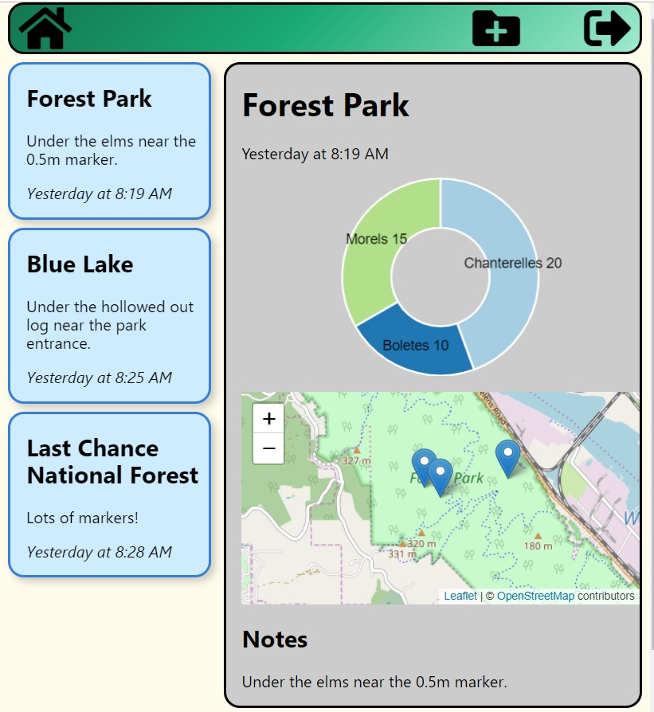

# Mushroom Forager's Friend

#### Names of Author
Chris Breaux

#### Date of Completion

5.23.2019

### Description

This a web app that allows mushroom hunters to keep track of their finds (species and quantity) as well as their locations.



### Current Features

* Visualizations of collected specimens
* Map marker placement and retrieval
* Geolocation
* Firebase Authentication

### Planned Features
* Precipitation Data
* Summary and Splash pages
* Search queries for user collections


### Known Bugs
* Issue placing map markers correctly depending on number of specimens entered into the form [BREAKING]
* Marker remains on screen even if specimen is removed. [BREAKING]
* Removing entry before placing marker causes an error. [BREAKING]

### Technologies and Resources

* ReactJS
* Redux
* Firebase
* ChartJS
* LeafletJS
* Tachyons


### Responsiveness

Site is fully responsive.

### Setup Instructions

* Clone file from https://github.com/cjbreaux/mff.git
* Navigate to the cloned folder in the terminal.
* While in the project folder, run the following in the terminal:
 ```html
$ npm i
```
* After the files have downloaded, run the following:
```html
$ npm start
```

### License

MIT License

Copyright (c) 2019 **Chris Breaux**
